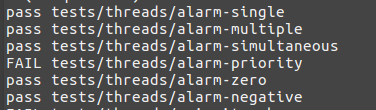

# Study-PintOS
운영체제 수업, Docker 환경을 활용한 PintOS 실습 과제

1. [project1. threads](./src/threads/DESIGNDOC)
2. [project2. user program]()

## project1. threads

### Goal

CPU 자원 활용을 위해 **blocked** 모드로 개발하는 것이 목표.

* `pontos/src/devices/timer.c`의 `timer_sleep()` 함수는 default로 **busy-wating** sleep mode로 설정이 되어있다.

### [-> DESIGNDOC](./src/threads/DESIGNDOC)

### Result

요구사항 통과 

## project2. user program

### Goal

User Program을 PintOS에서 실행될 수 있도록 해주는 것.

* 하나 이상의 프로세스가 수행되어야 한다.

### To do list

1. **Argument Passing and Setup Stack**
    * 프로그램 파일 이름을 Parsing 하고, 스택을 세팅해야한다.
    * `src/userprog/process.c` 를 주로보자.
1. **System Calls**
    * 요구한 각 시스템 콜 함수들을 구현해야 한다.
    * `src/userprog/syscall.c` 에 구현해야 할 함수들이 있다.

### Result